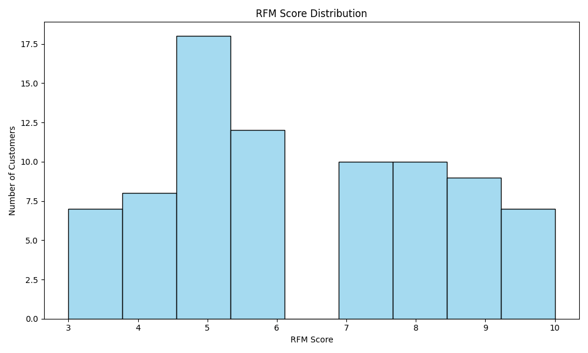

# 📊 Marketing Campaign Analysis Using SQL and Python

## Project Overview
This project explores marketing campaign performance by analyzing a simulated database of customers, campaigns, and campaign results.  
The goal is to practice SQL querying, database management, and data visualization to extract actionable business insights for marketing optimization.

All analysis is performed using **Python**, **SQLAlchemy**, **Pandas**, and **SQLite** within a **Jupyter Notebook**.

## 📂 Project Structure
## Project Structure
```
Marketing_Campaign_Analysis/
├── marketing_campaigns.db         # SQLite database
├── marketing_analysis.ipynb       # Jupyter Notebook with full analysis
├── images/                        # Folder with visualization images
│    ├── open_vs_click_rate.png
│    ├── top_campaigns.png
│    ├── top_customers.png
│    ├── funnel_analysis.png
│    ├── cohort_heatmap.png
│    ├── rfm_segmentation.png
├── README.md                      # Project documentation
├── requirements.txt               # List of used libraries
```

## 🛠 Technologies Used
- **Python** (Pandas, SQLAlchemy, Matplotlib, Seaborn, Faker)
- **SQLite** (Local Database)
- **Jupyter Notebook**

## 📋 Database Tables

### 🧾 Dataset Overview

The project uses a simulated dataset with the following structure:

- **Campaigns**: 10 unique marketing campaigns with varying budgets and start dates.
- **Customers**: 100 unique customers with demographic data (name, age, city).
- **Campaign Results**:
  - Total interactions: ~400–500 rows
  - Unique customers: 100
  - Opened emails: ~85% of customers
  - Clicked links: ~75%
  - Purchases made: ~60%

The data was generated using the `Faker` library to resemble realistic marketing behavior patterns. It includes multiple campaigns per customer and simulates typical user engagement levels across a conversion funnel.

## 🧐 Key Questions Answered
- What are the open and click rates for each campaign?
- Which marketing campaigns led to the most purchases?
- Who are the most active customers across campaigns?

## Key Analyses Conducted

### Funnel Analysis
We analyzed the customer journey from message delivery to final purchase. The funnel shows the drop-off at each stage (Opened, Clicked, Purchased).


### 📊 Funnel Analysis Insights
- Significant drop between delivered and opened emails suggests a need to improve subject lines or sender recognition.
- Additional drop from opened to clicked indicates weak call-to-actions or poor email content alignment.
- Slight increase at the purchase stage may reflect brand familiarity or returning customers converting through other channels.

### Cohort Analysis
We grouped customers by the month of their first campaign interaction and tracked purchases over time. This reveals customer retention patterns and repeat purchase behavior.


### 📅 Cohort Analysis Insights
- Late 2023 and early 2024 cohorts showed strong engagement, likely influenced by seasonal campaigns.
- Some cohorts demonstrate long-term retention with purchases even 12+ months after first contact.
- Recent cohorts are still new, and their long-term value remains to be seen.

### RFM Analysis
We segmented customers based on Recency, Frequency, and Monetary value of their purchases. This helps identify Champions, Loyal Customers, and At-Risk segments.



### 💬 RFM Insights
- Most customers fall into the middle range (RFM score 5–6), indicating moderate engagement.
- A smaller group scores high (8–10), representing loyal and high-value clients worth retaining.
- Low-score customers (3–4) may require re-engagement strategies or be excluded from future targeted campaigns.

### Basic Campaign Performance Metrics
We calculated Open Rates and Click Rates for each marketing campaign and identified the best-performing campaigns and most engaged customers.


## 📈 Key Insights
- Identified campaigns with the highest engagement rates.
- Highlighted campaigns that generated the most purchases.
- Found the top customers who engaged in multiple campaigns.
- Provided business recommendations based on customer behavior and campaign performance.

## 🚀 How to Run
1. Clone the repository.
2. Install dependencies:
    ```bash
    pip install -r requirements.txt
    ```
3. Open `marketing_analysis.ipynb` in Jupyter Notebook.
4. Run the notebook to generate insights and visualizations.

## 📬 Contact
Created by Mariia Maslova  
Feel free to connect!

